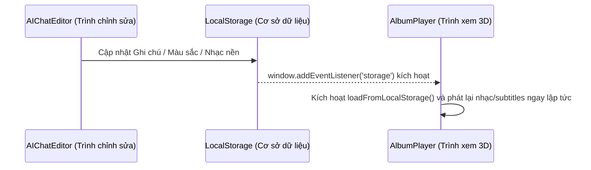

# 🏗️ Kiến Trúc Hệ Thống - Memories AI Creative Studio

Tài liệu này chi tiết hóa kiến trúc kỹ thuật, mô hình dữ liệu, luồng đồng bộ hóa dữ liệu thời gian thực và thiết kế giao diện của ứng dụng **Memories AI Creative Studio Pro**.

---

## 💻 Công Nghệ Cốt Lõi (Tech Stack)

*   **Frontend Library**: React 18+ (TypeScript) - Đảm bảo tính mở rộng cao và định kiểu an toàn.
*   **Build Tool**: Vite - Cho tốc độ khởi chạy cực nhanh và Hot Module Replacement (HMR) tức thì.
*   **Styling Engine**: Tailwind CSS - Xây dựng giao diện responsive và tùy biến nhanh chóng.
*   **Icons**: Lucide React & Google Material Symbols - Kho icon phong phú, hiển thị sắc nét.
*   **Animations**: Tailwind transitions, custom keyframe pulse, và `canvas-confetti` cho hiệu ứng tương tác cao cấp.

---

## 📂 Sơ Đồ Tổ Chức Mã Nguồn

```
📂 Tạo video tĩnh từ ảnh/
├── 📂 docs/                     # Lưu trữ toàn bộ tài liệu hệ thống (.md)
├── 📂 src/
│   ├── 📂 components/
│   │   ├── 📄 AmbianceSelector.tsx   # Bộ chỉnh giao diện, đồng bộ với Google Stitch
│   │   ├── 📄 Layout.tsx             # Thanh tác vụ dọc bên trái và khung sườn ứng dụng
│   │   └── ...
│   ├── 📂 pages/
│   │   ├── 📄 Home.tsx               # Màn hình FEED - Các thước phim ký ức
│   │   ├── 📄 PhotoSelector.tsx      # Màn hình TẠO - Tải ảnh máy & chọn ảnh kho chủ đề
│   │   ├── 📄 AIChatEditor.tsx       # Màn hình AI CHAT - Trình biên tập bằng ngôn ngữ tự nhiên
│   │   ├── 📄 AlbumPlayer.tsx        # Màn hình THƯ VIỆN - Sách lật tương tác 3D
│   │   └── ...
│   ├── 📄 App.tsx                # Quản lý định tuyến (React Router)
│   ├── 📄 index.css              # Custom styles và Design Tokens
│   └── 📄 main.tsx               # Điểm khởi chạy của React
```

---

## ⚡ Cơ Chế Đồng Bộ Hóa Thời Gian Thực (Real-time Sync)

Một trong những tính năng nổi bật của ứng dụng là khả năng chỉnh sửa và đồng bộ hóa tức thì giữa các màn hình nhờ **Cơ chế Lắng Nghe Sự Kiện Bộ Nhớ (Storage Event Listener)**.

### Sơ đồ hoạt động:


### Cách thức hoạt động:
1. **Ghi Dữ Liệu**: Khi người dùng thao tác ở tab **AI CHAT** hoặc đổi giao diện màu sắc, các thay đổi được cập nhật ngay lập tức xuống `localStorage` (ví dụ: `memories_photo_notes`, `memories_music_url`, `memories_created_albums`).
2. **Lắng Nghe Thay Đổi**: Tại **AlbumPlayer** và **Layout**, hệ thống sử dụng hook `useEffect` để đăng ký sự kiện `storage`:
   ```typescript
   window.addEventListener('storage', loadFromLocalStorage);
   ```
3. **Phản Hồi Trực Quan**: Ngay khi nhận được tín hiệu thay đổi từ tab khác, giao diện sẽ tự động re-render, cập nhật phụ đề, đổi màu chữ và thay thế bản nhạc nền đang phát mà không cần người dùng F5 tải lại trang!

---

## 🎵 Hệ Thống Âm Thanh Phản Xạ (Reactive Audio Engine)

Để đảm bảo nhạc nền hoạt động trơn tru, không bị chồng chéo nhạc khi chuyển đổi giữa các trang, hệ thống được thiết kế với một lớp quản lý âm thanh an toàn bằng `useRef`:

1. **Khởi tạo duy nhất**: Đối tượng `Audio` được bọc trong `audioRef = useRef<HTMLAudioElement | null>(null)` để tham chiếu vĩnh viễn trong suốt vòng đời component.
2. **Chuyển đổi bài hát mượt mà**:
   * Khi `activeMusicUrl` thay đổi, hệ thống sẽ tạm dừng bài nhạc cũ, giải phóng bộ nhớ, khởi tạo đối tượng `Audio` mới và tự động phát tiếp nếu trạng thái `isPlaying` đang kích hoạt.
3. **Điều khiển âm lượng theo chu kỳ**:
   * Giá trị âm lượng (`volume`) được liên kết chặt chẽ với đối tượng `Audio`:
     ```typescript
     audioRef.current.volume = volume;
     ```
   * Khi người dùng bấm nút âm lượng, mức âm lượng sẽ thay đổi theo chu kỳ (`0%` -> `20%` -> `50%` -> `80%` -> `100%`) giúp điều khiển nhanh chóng mà không cần thanh trượt phức tạp.

---

## 📐 Thanh Tác Vụ Dọc Trái (Vertical Left Layout)

Thanh tác vụ được tối ưu hóa theo yêu cầu của anh để giải phóng không gian thao tác ở trung tâm màn hình:

*   **Trình Duyệt Lớn (Desktop/Tablet)**: Chuyển sang dạng **khoang chứa dọc (vertical capsule)** cố định bên góc trái màn hình (`fixed left-4 top-1/2 -translate-y-1/2`). Thiết kế dạng kính mờ (Glassmorphism) cực kỳ hiện đại, không cản trở việc xem sách lật 3D hay chỉnh sửa ảnh.
*   **Thiết Bị Di Động (Mobile)**: Chuyển sang dạng **thanh dọc siêu nhỏ gọn** không có chữ (`fixed left-2 top-1/3`), tối đa hóa diện tích hiển thị của màn hình điện thoại giúp người dùng chạm vuốt thoải mái.
*   **Trọng tâm Nội dung**: Vùng hiển thị chính được dịch chuyển nhẹ sang phải (`md:pl-20`) để tạo ra sự cân bằng hoàn mỹ về thị giác.
