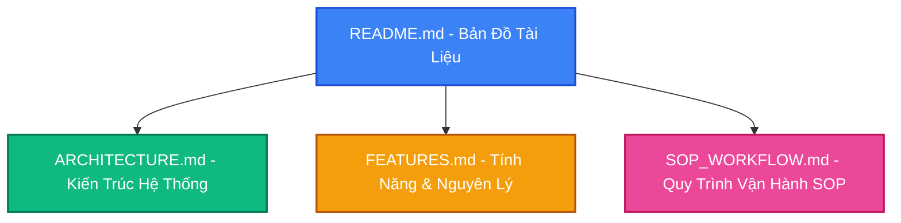

# 📚 Memories AI Creative Studio - Tài Liệu Hệ Thống

Chào mừng anh đến với hệ thống tài liệu chính thức của **Memories AI Creative Studio Pro**. Thư mục `docs/` này được thiết kế để lưu trữ toàn bộ kiến thức cốt lõi, kiến trúc kỹ thuật, nguyên lý hoạt động, và quy trình SOP của ứng dụng.

Khi cần cải tiến, nâng cấp hoặc bàn giao dự án, anh chỉ cần đọc qua các tài liệu này là có thể nắm bắt đầy đủ 100% tinh thần và công nghệ của hệ thống.

---

## 🗺️ Bản Đồ Tài Liệu Hệ Thống



### 1. 🏗️ [ARCHITECTURE.md](file:///Users/macos/PhuongNam-Dev-2026/Học%20viện%20AI/Tạo%20video%20tĩnh%20từ%20ảnh/docs/ARCHITECTURE.md)
*   **Mục tiêu**: Mô tả kiến trúc tổng thể của mã nguồn React + Vite + Tailwind CSS.
*   **Nội dung**: Sơ đồ luồng dữ liệu, cơ chế lưu trữ đồng bộ thời gian thực (`localStorage` + `storage` event listener), hệ thống âm thanh phản xạ, và cách liên kết các token thiết kế từ Google Stitch.

### 2. 🌟 [FEATURES.md](file:///Users/macos/PhuongNam-Dev-2026/Học%20viện%20AI/Tạo%20video%20tĩnh%20từ%20ảnh/docs/FEATURES.md)
*   **Mục tiêu**: Định nghĩa chi tiết từng tính năng của ứng dụng theo đúng ý đồ của anh.
*   **Nội dung**: 
    *   **Tab FEED (Ký ức gần đây)**: Trình diễn các thước phim ký ức.
    *   **Tab TẠO (Album Builder)**: Liên kết kho ảnh miễn phí chất lượng cao (Thiên nhiên, Sản xuất, Điện ảnh, AI), phân tích Nhân Tướng Học, và cấu hình cỡ chữ/màu sắc phụ đề.
    *   **Tab AI CHAT (Editor)**: Trình chỉnh sửa thông minh bằng ngôn ngữ tự nhiên, tích hợp bộ thay đổi nhạc nền tùy chỉnh và nhân kết xuất 3D Heygen.
    *   **Tab THƯ VIỆN (Library)**: Sách lật 3D tương tác cao cấp, điều khiển âm lượng chu kỳ, và xuất bản file offline tự chạy.
    *   **Tab BẢN SẮC (Ambiance)**: Tùy biến chủ đề màu sắc, phông chữ đồng bộ hóa.

### 3. 📋 [SOP_WORKFLOW.md](file:///Users/macos/PhuongNam-Dev-2026/Học%20viện%20AI/Tạo%20video%20tĩnh%20từ%20ảnh/docs/SOP_WORKFLOW.md)
*   **Mục tiêu**: Quy trình vận hành chuẩn (SOP) để phát triển và duy trì ứng dụng ổn định lâu dài.
*   **Nội dung**: Các bước kiểm tra code nghiêm ngặt trước khi bàn giao, quy trình build tự động, tiêu chuẩn thiết kế premium, và các chốt chặn an toàn (Security Gates).

---

## ⚡ Bắt Đầu Nhanh Với Dự Án

### Khởi chạy môi trường Phát triển (Local Dev):
```bash
npm run dev
```

### Biên dịch ứng dụng cho Production:
```bash
npm run build
```

---
*Tài liệu này được biên soạn bởi Memories AI Architect để lưu trữ tri thức trọn đời cho hệ thống.*
