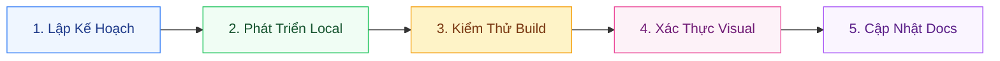

# 📋 Quy Trình Vận Hành SOP - Memories AI Studio

Tài liệu này thiết lập **Quy Trình Vận Hành Tiêu Chuẩn (SOP - Standard Operating Procedure)** giúp đảm bảo mọi cập nhật, cải tiến hay sửa đổi mã nguồn đều đạt tiêu chuẩn chất lượng cao nhất, tuyệt đối không gây lỗi hệ thống.

---

## 🧭 Quy Trình 5 Giai Đoạn Phát Triển



### 1️⃣ Giai Đoạn 1: Lập Kế Hoạch & Phân Tích Yêu Cầu (Planning)
*   **Hành động**: Đọc kỹ yêu cầu của anh để hiểu rõ bối cảnh và ý đồ thiết kế.
*   **Quy tắc**: Xác định rõ các tập tin và cấu phần (components) nào sẽ chịu ảnh hưởng của thay đổi. Lên phương án sửa đổi chi tiết trước khi thực hiện viết code.

### 2️⃣ Giai Đoạn 2: Phát Triển Local & Bảo Toàn Mã Nguồn (Development)
*   **Hành động**: Thực hiện chỉnh sửa mã nguồn bằng các công cụ chỉnh sửa có định hướng rõ ràng.
*   **Quy tắc bắt buộc**:
    *   *Giữ nguyên chú thích*: Tuyệt đối không xóa các dòng ghi chú (`// comments`) hoặc docstring cũ không liên quan.
    *   *Không dùng placeholder*: Mọi đoạn mã viết ra phải chạy được ngay, không viết kiểu ba chấm (`// ...`) hay bỏ lửng.
    *   *Responsive*: Đảm bảo mã nguồn hoạt động hoàn hảo trên cả Mobile (dọc) và Desktop (ngang).

### 3️⃣ Giai Đoạn 3: Kiểm Thử Biên Dịch (Build Verification)
*   **Hành động**: Sau khi sửa bất kỳ file nào, bắt buộc phải chạy lệnh biên dịch dự án:
    ```bash
    npm run build
    ```
*   **Quy tắc**: Nếu quá trình biên dịch báo lỗi (dù chỉ là cảnh báo kiểu TypeScript), tuyệt đối không được bàn giao cho anh. Phải tiến hành sửa hết lỗi biên dịch trước khi đi tiếp.

### 4️⃣ Giai Đoạn 4: Xác Thực Trực Quan (Visual Verification)
*   **Hành động**: Mở ứng dụng trên trình duyệt local để kiểm tra thực tế xem các tính năng chạy đúng ý chưa:
    *   *Thử nghiệm pháo hoa*: Tải nhiều ảnh cùng lúc, đảm bảo hiệu ứng pháo hoa nổ đẹp mắt.
    *   *Kiểm tra âm thanh*: Bật/tắt âm lượng chu kỳ, lồng bản nhạc riêng từ máy tính và chuyển trang xem nhạc có bị ngắt quãng không.
    *   *Đồng bộ*: Thử thay đổi ghi chú ở AI Chat và xem ngay ở tab Thư viện để chứng thực cơ chế đồng bộ thời gian thực hoạt động tốt.

### 5️⃣ Giai Đoạn 5: Cập Nhật Tài Liệu Hệ Thống (Documentation)
*   **Hành động**: Khi tính năng mới được hoàn thành ổn định, lập tức cập nhật lại các file tài liệu trong thư mục `docs/` để giữ thông tin luôn chính xác và đồng nhất với thực tế mã nguồn.

---

## 🛡️ Các Chốt Chặn An Toàn (Quality Gates)

| Trạng thái | Tiêu chuẩn chất lượng | Cách thức kiểm soát |
| :--- | :--- | :--- |
| **Giao diện** | Giao diện Premium, bo góc mềm mại, độ trong suốt kính mờ (glassmorphism) | Kiểm duyệt thủ công qua Chrome DevTools |
| **TypeScript** | Định kiểu rõ ràng, không dùng kiểu `any` bừa bãi | Trình biên dịch `tsc` khi chạy build |
| **Âm thanh** | Phát nhạc mượt mà, dừng đúng lúc, không chồng chéo bản nhạc | Kiểm thử trực tiếp bằng tai nghe ở nhiều tab |
| **Dữ liệu** | Lưu trữ bền vững, đồng bộ thời gian thực qua nhiều màn hình | Kiểm tra `Application` -> `Local Storage` trong DevTools |
